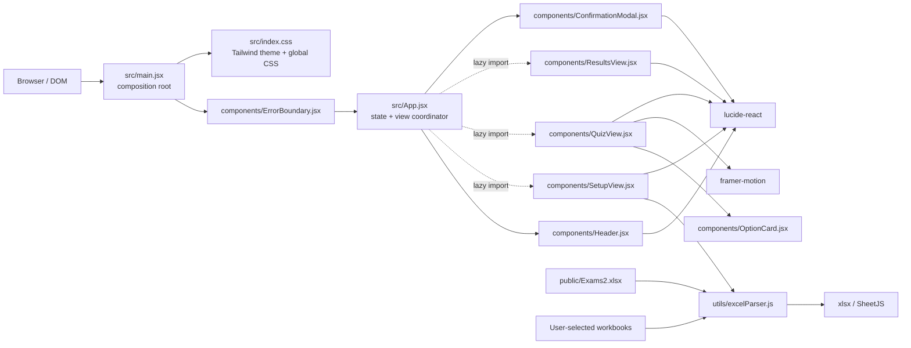
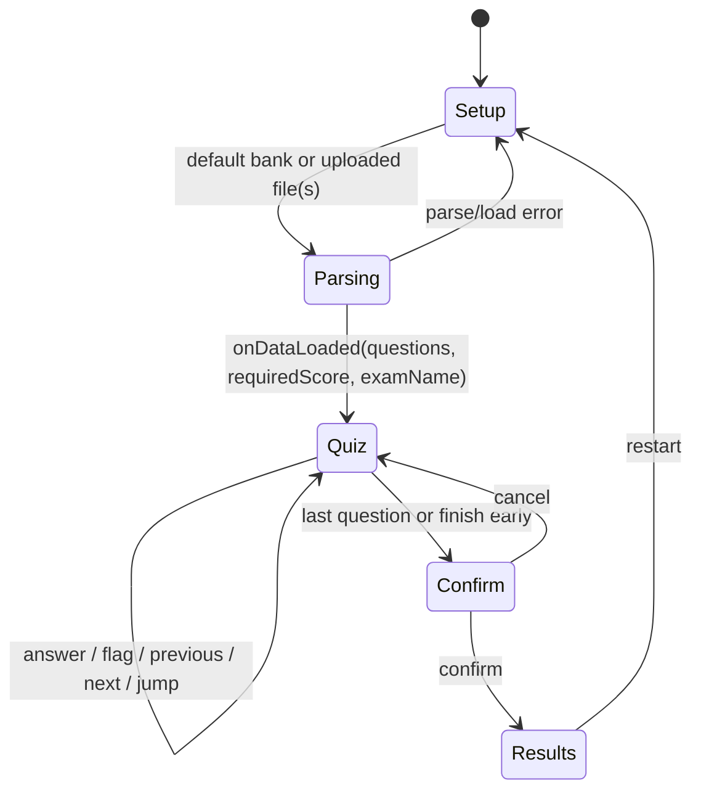
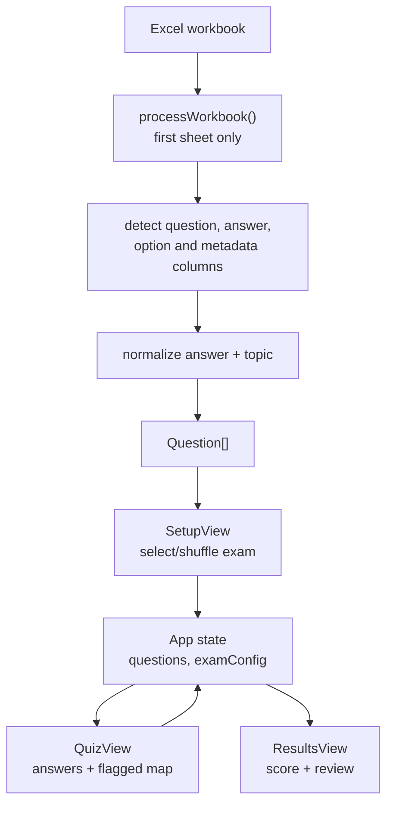
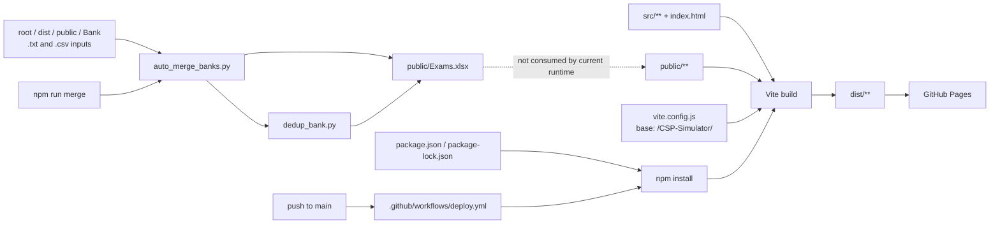

# Code Review Graph

This document maps the repository by runtime dependency and review impact. An arrow means **the source depends on, invokes, or supplies data to the target**.

## Runtime dependency graph

## State and user-flow graph

`App.jsx` owns the cross-view state. Child views receive state and callbacks; they do not route directly.

## Build, data preparation, and deployment

## Review order and impact boundaries

| Review slice | Start here | Follow impact into | Main checks |
| --- | --- | --- | --- |
| Workbook ingestion | `src/utils/excelParser.js` | `SetupView.jsx`, `public/Exams2.xlsx`, results grading | Header variants, malformed rows, answer matching, topic normalization, rejected files |
| Exam creation | `src/components/SetupView.jsx` | `App.jsx`, parser | Shuffle/sampling rules, requested count, required score, loading and error state |
| Session state | `src/App.jsx` | Header, quiz, modal, results | State resets, index bounds, one-answer rule, progress, transitions |
| Quiz interaction | `src/components/QuizView.jsx` | `OptionCard.jsx`, `App.jsx` callbacks | Keyboard/focus behavior, flag/grid state, animation, navigation edge cases |
| Scoring and review | `src/components/ResultsView.jsx` | `App.jsx` state and parser output | Skipped answers, pass threshold, topic totals, explanation rendering |
| Styling/theme | `src/index.css` | Every React component | Responsive layout, dark mode, external font availability, contrast |
| Deployment | workflow + `vite.config.js` | built asset URLs and default workbook fetch | Pages base path, Node version, reproducible install, artifact contents |
| Bank maintenance | root Python scripts | `public/Exams.xlsx` | Destructive rewrites, duplicate policy, schema compatibility with parser |

## High-risk review nodes

- `src/utils/excelParser.js` is the data contract for the whole app. A parsing or normalization change can alter exam composition and grading without a component failure.
- `src/App.jsx` is the single state coordinator. Changes to question identity, navigation, submission, or reset behavior affect all three views.
- `src/components/ResultsView.jsx` is a correctness boundary: it converts stored answers and configuration into the user-visible score.
- `public/Exams2.xlsx` is the shipped runtime bank, while the maintenance scripts currently write `public/Exams.xlsx`. That disconnect is a review hotspot: running `npm run merge` does not update the bank fetched by the app.
- `vite.config.js` and the Pages workflow jointly determine production asset paths. Review base-path changes as deployment changes, not only build configuration changes.

## Practical review paths

For a pull request, begin at every changed node and walk arrows downstream. In particular:

1. Parser or workbook change: parser → setup → app state → quiz/results.
2. State-contract change: app → every child receiving the changed prop or callback.
3. Component-only change: component → its direct children, then check callbacks back into `App.jsx`.
4. Build/configuration change: Vite config/public assets → `dist` behavior → Pages workflow.
5. Question-bank tooling change: merge/dedup scripts → generated workbook → parser compatibility.

